## 📑 Table of Contents

- [Forensics](#forensics)
  - [Event Viewing](#event-viewing)
  - [Bitlocker 1](#bitlocker-1)
  - [Bitlocker 2](#bitlocker-2)
  - [Blast From The Past](#blast-from-the-past)
  - [Corrupted File](#corrupted-file)
  - [Dear Diary](#dear-diary)
  - [Disco 1](#disco-1)
  - [Disco 2](#disco-2)
  - [Disco 3](#disco-3)
  - [Mob Psycho](#mob-psycho)
  - [Flag In Flame](#flag-in-flame)
  - [Hidden In Plain Sight](#hidden-in-plain-sight)
  - [Hide Me](#hide-me)
  - [Lookey Here](#lookey-here)
  - [Operation Orchid](#operation-orchid)
  - [Red](#red)
  - [Redaction Gone Wrong](#redaction-gone-wrong)
  - [Riddle Registry](#riddle-registry)
  - [Scan Surprise](#scan-surprise)
  - [Secret Of The Polyglot](#secret-of-the-polyglot)
## Forensics
### Event Viewing

### Bitlocker 1
First, the BitLocker hash was extracted from the disk image:

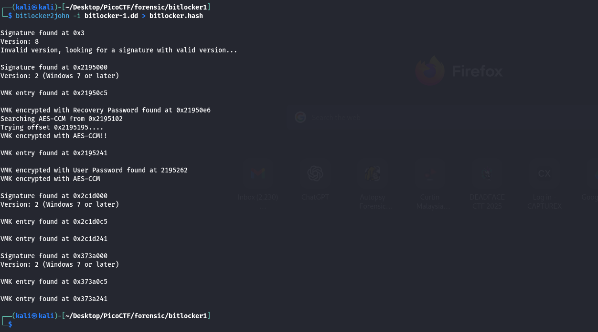

The password was brute-forced using John the Ripper with the rockyou wordlist:

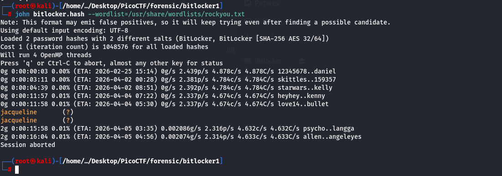

The recovered password was: **`jacqueline`**

A directory was created and the BitLocker volume was unlocked using Dislocker:

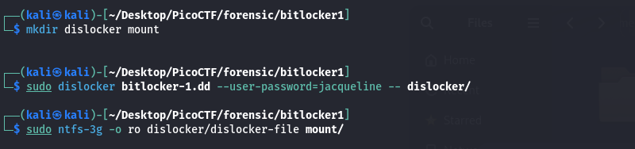

The decrypted NTFS volume was mounted read-only:

The extracted file was searched for the flag:

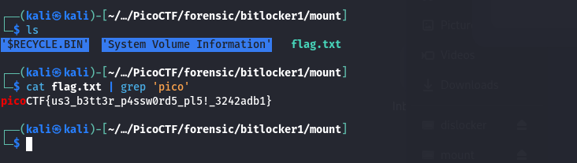

#### 🚩 Flag: picoCTF{us3_b3tt3r_p4ssw0rd5_pl5!_3242adb1}
#

### Bitlocker 2
hey actually give two files:
**`Bitlocker-2.dd`** and **`memdump.mem.gz`**.

At first I was like:
“Oh okay, same as BitLocker 1, extract hash, crack password, dislocker, mount…”

…but nah 😭

Instead, I just went full lazy mode and checked the memory dump:
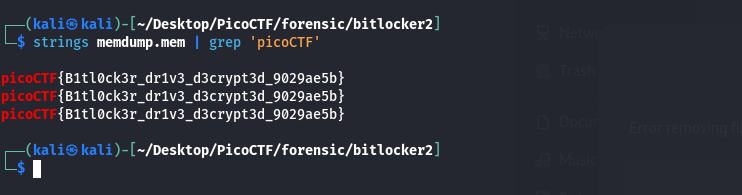
#### 🚩 Flag: picoCTF{B1tl0ck3r_dr1v3_d3crypt3d_9029ae5b}
#

### Blast From The Past

### Corrupted File

### Dear Diary
First, I extracted the `.gz` file and opened it in **Autopsy** for analysis.

While browsing the extracted files, I noticed a suspicious file named **`innocuous-file.txt`**.  

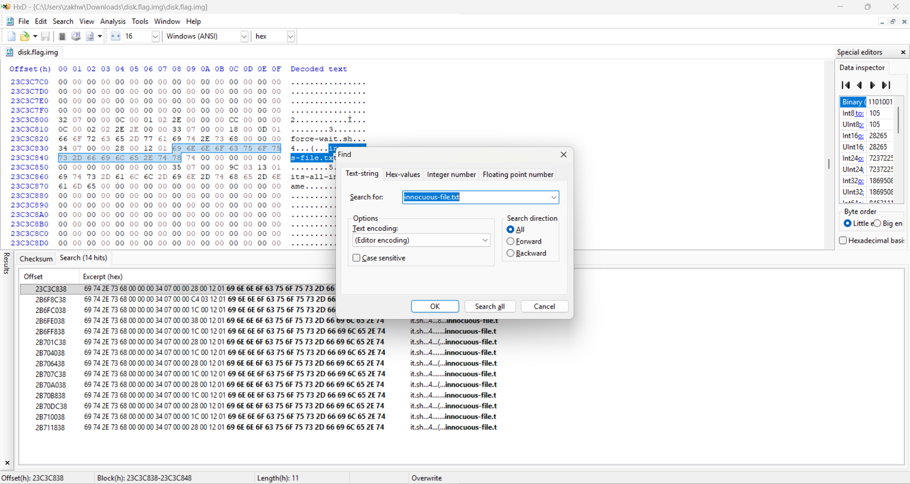
I inspected this file using **HxD** and searched for its occurrences across the disk image.

Each occurrence contained a **partial fragment of the flag**.  
By extracting all the fragments and combining them together, I was able to recover the full flag.

#### 🚩 Flag: picoCTF{1_533_n4m35_80d24b30}
#

### Disco 1
This challenge is so easy. you just need to strings and grep the flag.

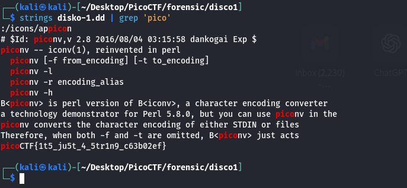
#### 🚩 Flag: picoCTF{1t5_ju5t_4_5tr1n9_c63b02ef}
#

### Disco 2
First, the disk image was searched for flag strings:
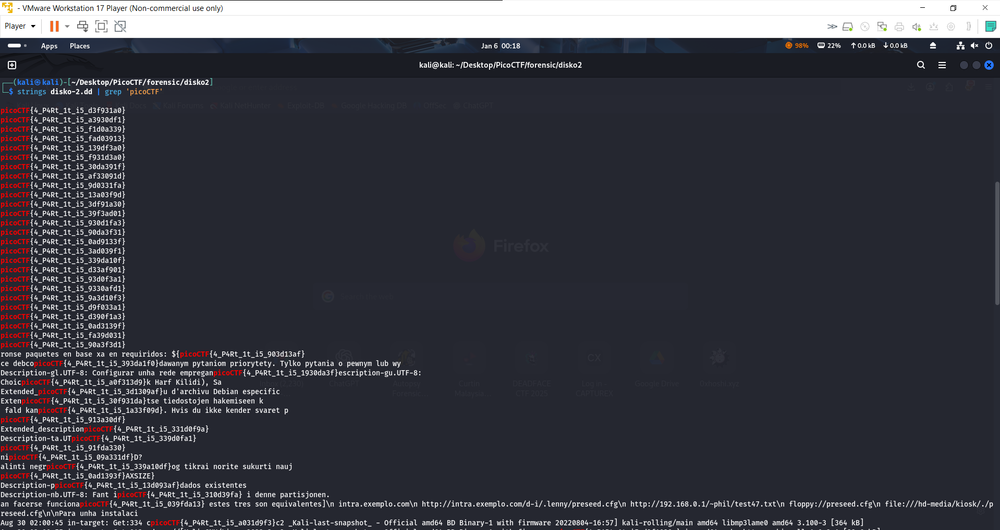

This returned multiple flags, so the hint was followed stating the correct flag is in the Linux partition.

The partition table was analyzed using:

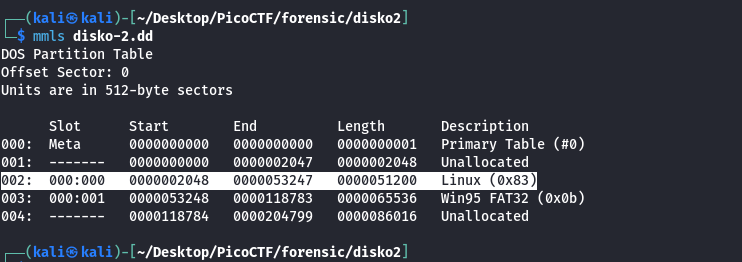

This showed the Linux partition starting at sector 2048 with 51200 sectors.

The Linux partition was extracted:

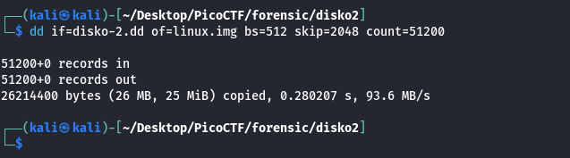

Finally, the extracted image was searched for the flag:

#### 🚩 Flag: picoCTF{4_P4Rt_1t_i5_90a3f3d1}
#

### Disco 3
I open Autopsy and search keyword 'picoCTF' for the flag:

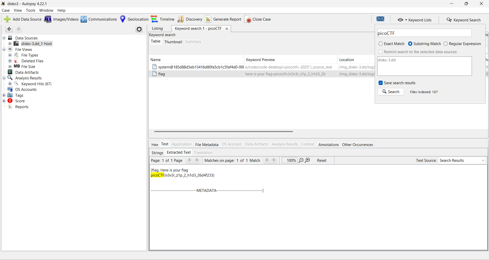

the flag is inside the flag file

#### 🚩 Flag: picoCTF{n3v3r_z1p_2_h1d3_26d4f233}
#

### Mob Psycho
Honestly… I had no clue what was going on at first.

So I did the most CTF thing possible:

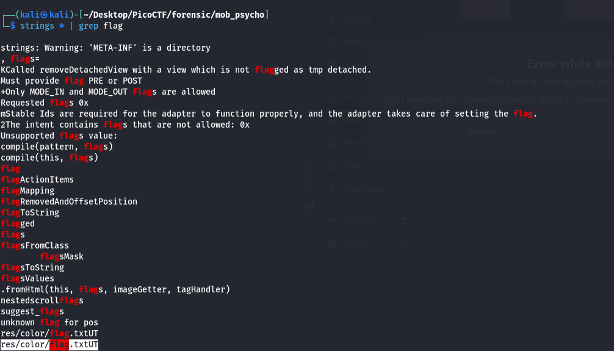

And somehow… it worked 💀
I found a flag.txt file inside the res/color/ directory.

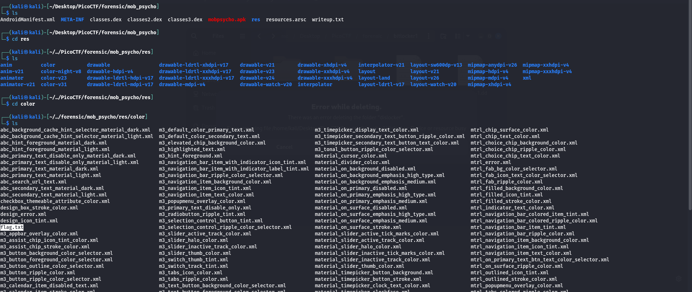

When i cat the flag, it got hex string

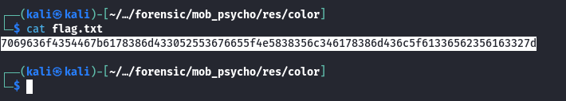

Then i convert at Cyberchef and retrieve the flag:

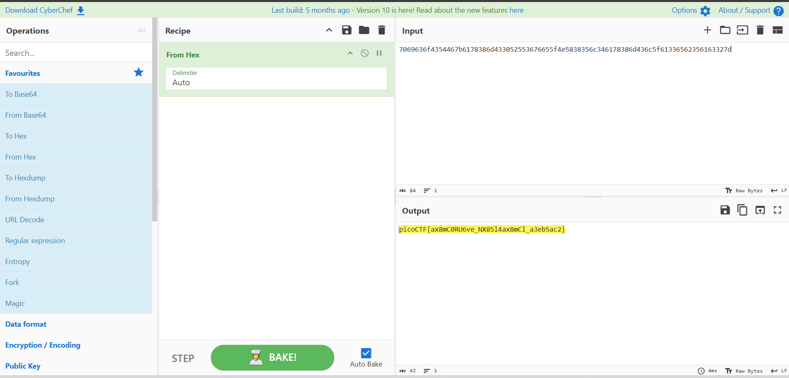

#### 🚩 Flag: picoCTF{ax8mC0RU6ve_NX85l4ax8mCl_a3eb5ac2}
#

### Flag In Flame

### Hidden In Plain Sight

### Hide Me
First thing I did was throw the file into binwalk:

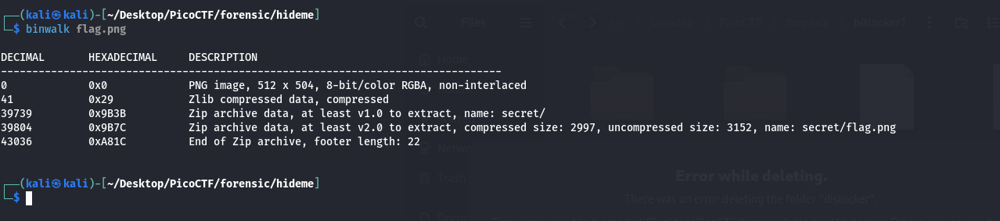

Turns out… surprise surprise 🎉
There’s a ZIP file hiding inside the image.

So I extracted it manually using dd:
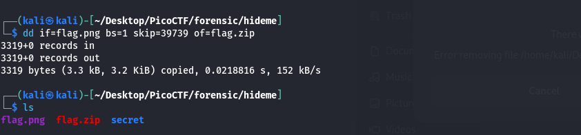

Unzipped it and found another flag.png chilling inside the secret directory.

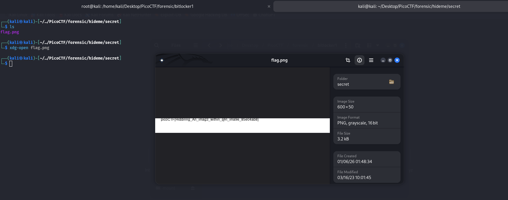

Opened it, and boom — flag acquired 🏁

#### 🚩 Flag: picoCTF{Hiddinng_An_imag3_within_@n_ima9e_85e04ab8}
#

### Lookey Here

### Operation Orchid

### Red

### Redaction Gone Wrong

### Riddle Registry

### Scan Surprise
### Event Viewing

**Category:** Forensics  
**Difficulty:** Easy  

#### 📜 Description
...

#### 🔍 Analysis
...

#### 🛠 Solution
...

#### 🚩 Flag

### Secret Of The Polyglot

